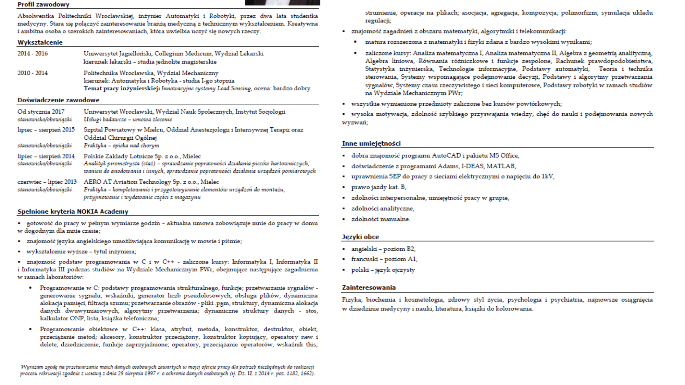
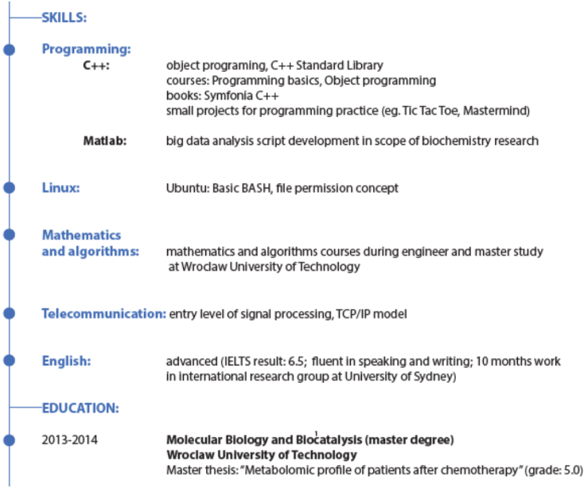
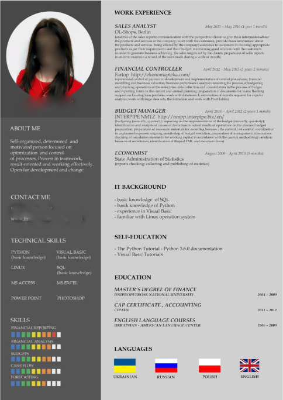
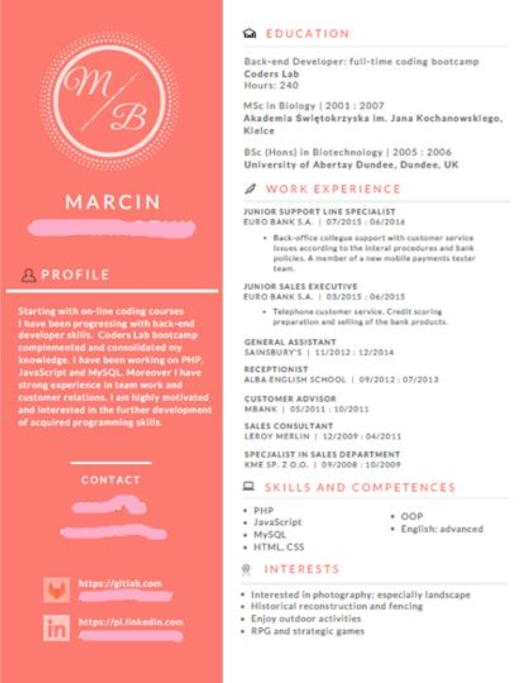
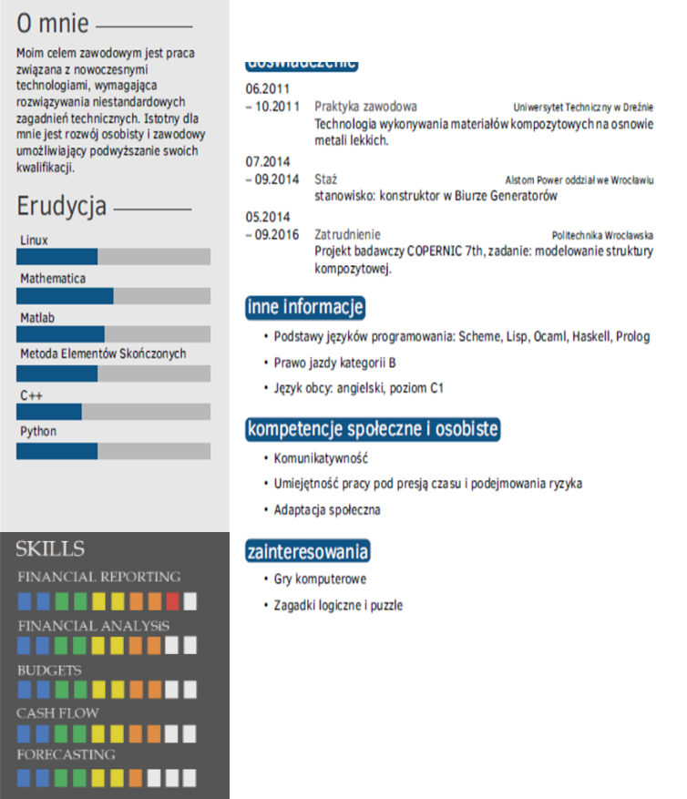
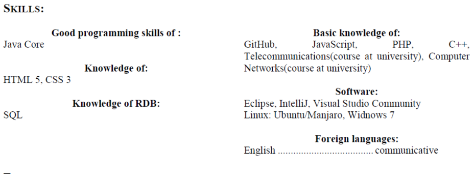

<!-- .slide: data-background="#111111" -->

# CV programisty

___

## CV programisty - Co jest dobre?

___

  ## Umiejętności Programistyczne

  

___

  ## Kody QR do profili

  

___

  ## Przejrzystość oraz ciekawość układu

      

  ###### Uwaga! Brakuje tu zgody na przetwarzanie danych osobowych

  

___

  ## Przejrzystość oraz ciekawość układu

      

  ###### Uwaga! Brakuje tu zgody na przetwarzanie danych osobowych

  

___

## CV programisty - czego unikać?

  ### Nic nie mówiące "paski umiejętności"

  

___

  ### Selfies

  

___

### Nieprofesjonalne adresy email

* <!-- .element class="fragment fade-in"-->lahsdbdf@...
* <!-- .element class="fragment fade-in"-->dark.vampire@...
* <!-- .element class="fragment fade-in"-->...@buziaczek.pl

<!-- .element class="fragment fade-in"-->
<!--Added some .gif to get rid of to much free space-->

___

### Nietypowe wyrównanie albo brak wyrównania tekstu

<!-- .element class="fragment fade-in"-->

___

## CV Programisty

<section>

  Moje CV

  

</section><!-- .element class="fragment fade-in"-->

<section>

  Wasze CV

  

</section><!-- .element class="fragment fade-in"-->

